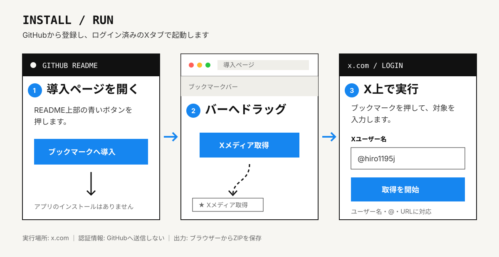
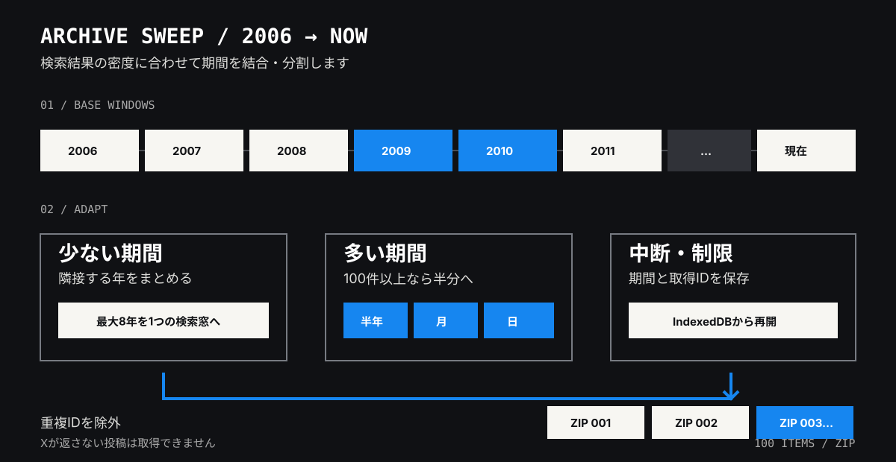

# XUserMedia-Downloader

Xのユーザー名またはプロフィールURLを入力すると、**Xの検索で取得できる画像・GIF・動画を年代ごとに探し、100件ずつZIPへ保存するブックマークレット**です。

PCへのアプリ・拡張機能のインストール、GitHub Actions、GitHub Secret、有料のX APIは使いません。処理はログイン済みのXタブ内で動きます。

[](https://pukutai3.github.io/XUserMedia-Downloader/?v=2.3.0)

> [!IMPORTANT]
> このツールは「Xの検索結果に現れるメディア」を可能な限り取得します。削除済み・非公開・閲覧権限外・Xの検索に収録されていない投稿までは取得できません。



## まず使う — 3ステップ

### 1. ブックマークへ登録

上の青い「ブックマークへ導入」ボタンを開き、表示された **「Xメディア取得」ボタンをブックマークバーへドラッグ**します。

- Firefoxでブックマークバーが見えない場合: 画面上部を右クリック →「ブックマークツールバー」→「常に表示」
- スマートフォン版ブラウザーは対象外です。PC版のFirefox、Chrome、Edgeを使ってください。

### 2. ログイン済みのXで起動

[x.com](https://x.com/home) を開き、登録した「Xメディア取得」ブックマークを押します。GitHubのページ上ではなく、**Xを表示しているタブ上で押す**必要があります。

### 3. 対象ユーザーを入力

次のどの形式でも入力できます。

```text
hiro1195j
@hiro1195j
https://x.com/hiro1195j
```

「取得を開始」を押すと全期間の走査が始まります。処理中はXのタブを開いたままにしてください。

## 保存が始まったら

- メディアはブラウザー内でZIP化され、**100件ごと**に保存されます。
- 2つ目以降は画面の「次のZIPを保存」を押します。
- ZIPにはメディア本体と、投稿ID・投稿日時・元投稿URL・成否を記録した `manifest.json` が入ります。
- 取得制限に達した場合は解除時刻まで待ち、タブが開いていれば自動再開します。
- タブを閉じても進捗はXのサイトデータへ残り、次回の起動時に同じ期間から再開します。

> [!WARNING]
> ブラウザーが複数ファイルのダウンロードを確認した場合は許可してください。「保存済みの進捗を削除して最初から」は、再開データと取得済みIDを消したい場合だけ押してください。

## なぜ古い投稿まで探せるのか



通常の1本の検索は途中で結果が終わることがあります。このツールは検索範囲を日付で分けて走査します。

1. 2006年から現在までを、まず1年単位で検索します。
2. 結果が少ない期間は、次の期間とまとめて最大8年まで検索します。
3. 結果が100件以上の期間は、半年、月、日へ自動的に分割します。
4. 各期間内では投稿IDの境界 `max_id` を使って過去側へ進みます。
5. 取得済みのメディアIDはIndexedDBへ記録し、重複保存を避けます。

この処理はXの取得制限を回避するものではありません。制限を受けたら解除まで待ち、保存した期間から再開します。

## 保存対象

| 対象 | 保存内容 |
| --- | --- |
| 画像 | X配信元のオリジナルサイズ |
| GIF | Xが配信するMP4 |
| 動画 | 利用可能な中で最高ビットレートのMP4 |
| 付属情報 | `manifest.json` に投稿ID、日時、元投稿URL、保存成否 |

対象ユーザー自身の投稿を保存します。リポストや引用元ユーザーのメディアは除外します。

## 認証情報とプライバシー

| 情報 | 保存先・送信先 |
| --- | --- |
| Xのパスワード | 読み取りません |
| ログインCookie | GitHubや外部サーバーへ送信・保存しません |
| XのCSRF情報 | 表示中のXタブからXへの通信にだけ使用します |
| 進捗・メディアURL・取得済みID | Xと同じオリジンのIndexedDBへ保存します |
| 画像・動画 | Xの配信元からブラウザーへ直接取得します |

ブックマークレットのコードはGitHub Pagesから導入時に読み込みますが、実行時はブックマーク内に保存されたコードがXタブで動きます。

## 中断・再開・やり直し

- **中断:** 「中止」を押します。取得済みのページと期間は残ります。
- **再開:** 同じXユーザー名で再実行します。
- **取得制限:** 画面に再開予定時刻を表示し、その時刻以降に自動再開します。
- **最初から:** 「保存済みの進捗を削除して最初から」を押します。既存ZIPは削除されません。
- **ブラウザーのサイトデータを削除:** IndexedDBの進捗も失われます。

## 対応環境

- PC版 Firefox、Chrome、Edgeの最新版
- JavaScriptブックマークレットを許可する通常ウィンドウ
- x.comへログイン済みであること

プライベートブラウズでは、ウィンドウを閉じると進捗が消える場合があります。

## 取得できないもの・既知の制約

- 削除済み、非公開、凍結、年齢・地域・閲覧権限で表示できない投稿
- Xの検索インデックスに現れない投稿
- X側の仕様変更後、ツールが更新されるまでの期間
- 同じ日に検索上限を大きく超える投稿があり、Xがそれ以上を返さない場合
- ブラウザーのメモリ、ストレージ、ダウンロード許可を超える大容量データ

画面の「全期間を走査しました」は、**Xが返した日付範囲をすべて処理した**という意味であり、アカウントが過去に投稿した全ファイルの存在証明ではありません。

## 困ったとき

| 症状 | 確認すること |
| --- | --- |
| ブックマークを押しても画面が出ない | x.com上で押したか、ブックマークURLが `javascript:` で始まるか |
| 「ログイン済みのx.com上で」と表示される | Xへログインし、Xのタブで再実行する |
| 取得制限の表示が出る | 表示された時刻まで待つ。進捗は保持される |
| ZIPが保存されない | ブラウザーのダウンロード許可と保存先を確認する |
| エラー原因を報告したい | Firefox/Chromeの開発者コンソールにある `[XMD 2.3.0]` の行と画面をIssueへ添付する |

不具合報告は [Issues](https://github.com/pukutai3/XUserMedia-Downloader/issues) へ。対象ユーザー名やログに個人情報が含まれる場合は、公開前に伏せてください。

## 開発者向け

- 編集元: `docs/bookmarklet.js`
- 配布用圧縮版: `docs/bookmarklet.min.js`
- 導入ページ: `docs/index.html`
- ブックマーク生成: `docs/installer.js`

圧縮版を更新した場合は、導入ページとREADMEのバージョン付きURLも同時に更新してください。

## 利用上の注意

対象者の権利、Xの利用規約、著作権、プライバシーを守り、私的な調査・正当なアーカイブの範囲で使用してください。取得できることは、再配布や公開の権利があることを意味しません。
